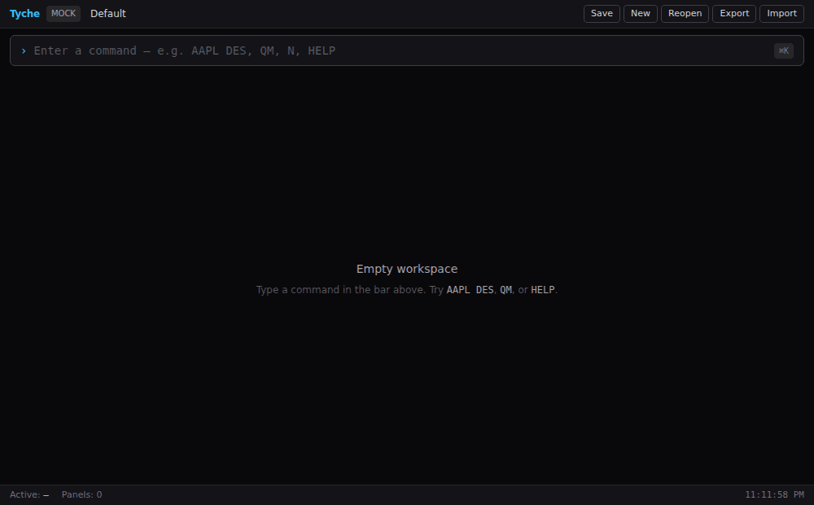
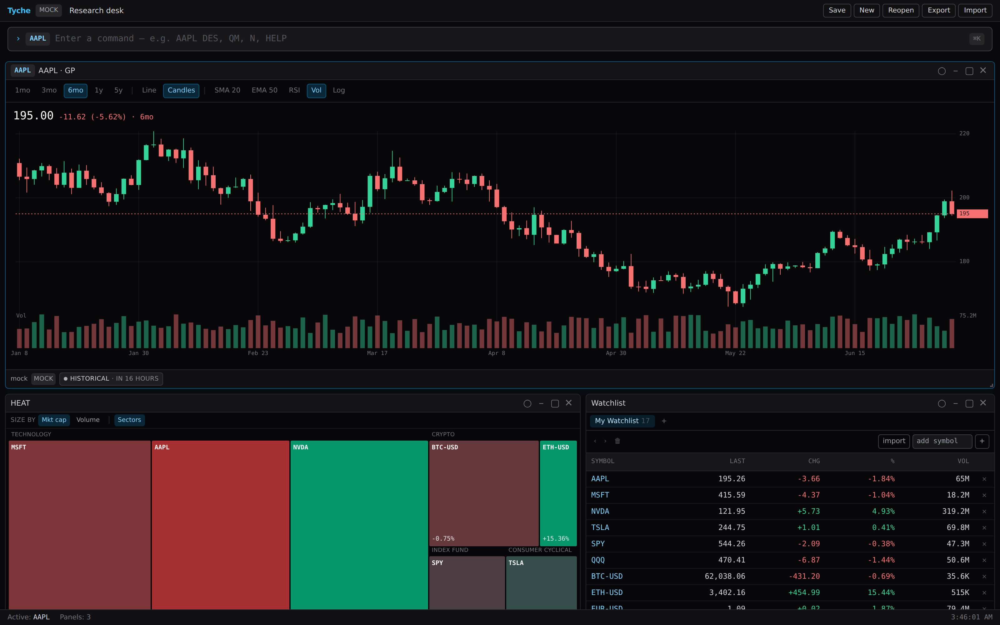
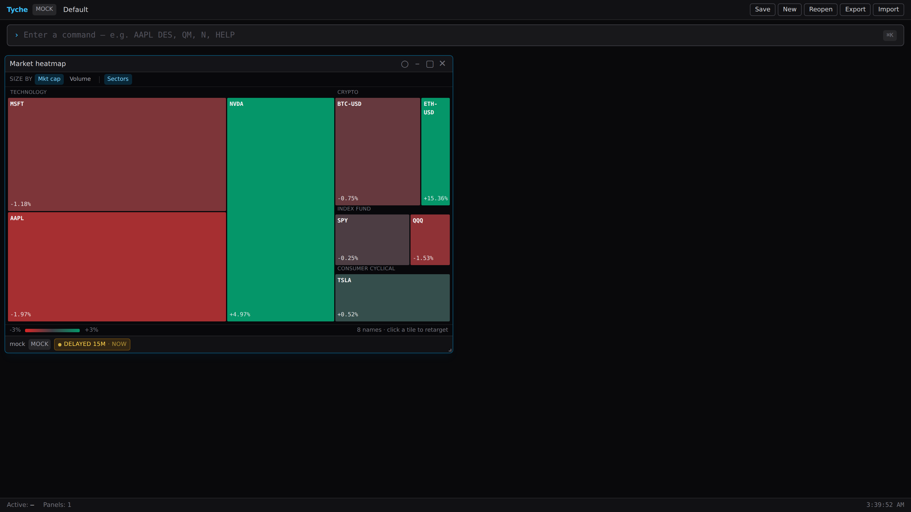
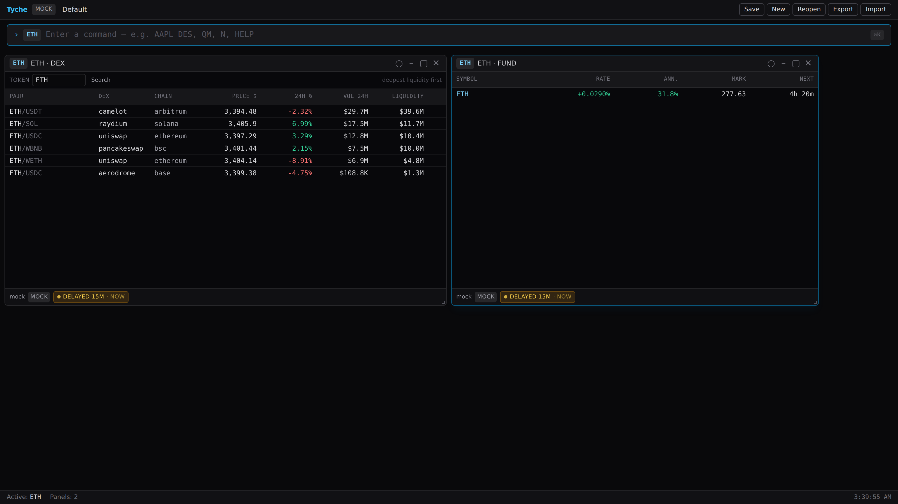

# Tyche

**A keyboard-first, self-hostable research terminal for crypto, macro & markets — real keyless data, no lock-in.**

Tyche is a fast, browser-native market research terminal for solo operators and small research
teams. It leads with what's **real and free**: live crypto depth, perp funding and on-chain DEX
pools, macro series, a Treasury yield curve, SEC filings and global news — all **keyless, no account
needed**. Equities (EOD), FX and the rest round it out, and real-time or premium feeds slot in with
**your own key** behind capability flags. It also runs **fully in mock mode with no keys at all**,
so nothing is gated behind a signup to try.

> **Not financial advice.** Tyche displays market data and educational analysis only. It does
> **not** tell you to buy, sell, or hold any security, and it is **not** a broker — the foundation
> places no orders. Live market data requires appropriate licenses/entitlements; see
> [`SECURITY.md`](./SECURITY.md) and [`DATA_PROVIDERS.md`](./DATA_PROVIDERS.md).

This is a **clean-room** project. It is inspired only by *publicly documented* market-terminal
feature categories used as benchmarks. It does not copy any proprietary product's branding, UI,
assets, private APIs, trade dress, or undocumented behavior.



<p align="center"><em>Type a command, get a panel — live crypto depth, on-chain DEX pools, perp funding, macro series and charting, keyless out of the box.</em></p>

| Research desk — `AAPL GP` + `HEAT` + `W` | Sector treemap — `HEAT` | On-chain pools + funding — `ETH DEX`, `FUND` |
| :---: | :---: | :---: |
|  |  |  |

---

## One-command demo

```bash
docker compose up          # → open http://localhost:4010
```

Or pull the prebuilt image (published by the release workflow from v0.3.0 on):

```bash
docker run -p 4010:4010 -v tyche-data:/app/data ghcr.io/ayyitskevin/tyche:latest
```

**Public read-only demo** (anyone can drive it, nothing is saved — for a "try it live, no signup" link):

```bash
docker run -e TYCHE_DEMO=true -p 4010:4010 ghcr.io/ayyitskevin/tyche:latest
```

One container: the API serves the built terminal same-origin, persists to a named volume, and seeds
a starter layout (chart + description + watchlist + news tape) on first run. No keys needed.

Without Docker (Linux/macOS):

```bash
pnpm install && pnpm demo  # builds the web app, serves it from the API on :4010
```

## Development quickstart

```bash
# Requirements: Node >= 20.10 (Node 22 for SQLite persistence), pnpm 10+
pnpm install      # install the workspace
pnpm dev          # starts the API (:4010) and the web app (:5173) in mock mode
```

Open <http://localhost:5173>, press **⌘/Ctrl+K**, and type — autocomplete finds commands by id,
alias, fuzzy match, or title, and finds symbols live via the enabled provider's search:

| Type this            | You get                                                        |
| -------------------- | -------------------------------------------------------------- |
| `AAPL GP`            | Candlestick chart — axes, volume pane, SMA/EMA/RSI, crosshair OHLCV readout |
| `AAPL GIP`           | Hi-res intraday chart (1m–1h bars), same surface               |
| `AAPL DES`           | Security description + live quote (with market session)        |
| `QM` / `W`           | Streaming quote monitor / watchlist (tabs, batch import)       |
| `EQS` / `MOST` / `HEAT` | Equity screener (saved presets) / market movers / market treemap |
| `AAPL EVT`           | Corporate events calendar — earnings, dividends, splits        |
| `ECO GDP`            | Macro economic series (FRED-backed when a key is set)          |
| `BTC-USDT BOOK` / `FUND` | Level-2 order-book ladder / perp funding board (live via Binance, mock keyless) |
| `FX` / `EUR-USD GP`  | FX majors board + converter / currency chart (live ECB rates when enabled) |
| `OVME` / `CALC`      | Black–Scholes option pricer / financial calculator             |
| `ETH DEX` / `COMM`   | On-chain DEX pools (venue, chain, price, liquidity) / commodities board |
| `COMP`, `WEI`, `TAS`, `OMON`, `FA`, `CF`, `N`, `TOP`, `EM`, `ANR`, `HDS`, `PORT`, `NOTE`, `ALERT` | …and the rest — `HELP` lists all 41 stable commands |
| `LAYOUT`             | Named workspace layouts — switch, fork, manage                 |
| `AI`                 | Context-grounded copilot with citations (mock mode, no key)    |

`pnpm dev` needs no credentials — everything is served by the deterministic **mock provider**,
which even models market sessions (pre/regular/post/closed) and a corporate-events calendar.

### Verify it works

```bash
pnpm typecheck     # strict TS across all packages (no errors)
pnpm test          # 520+ unit/contract/API tests (Vitest)
pnpm test:e2e      # 35 Playwright browser journeys (charts, autocomplete, DEX pools, layouts, …)
pnpm build         # production web bundle
```

---

## Feature highlights

- **Professional charting** — original canvas renderer: candlesticks or line, labelled price/time
  axes with gridlines, volume histogram, SMA/EMA overlays, RSI study pane, last-price marker, a
  crosshair with OHLCV readout that never redraws the chart, wheel zoom + drag pan, and a log
  scale. Daily (`GP`) and intraday (`GIP`).
- **Command palette that stays on the keyboard** — ranked autocomplete (prefix → alias → fuzzy →
  title) plus live symbol search from the enabled provider; ↓/↑ select, Tab fills, Enter runs,
  Esc dismisses; every chord (focus/save/reopen) is user-rebindable in `SETTINGS`.
- **41 stable commands** across market data, research, fundamentals, analytics, portfolio, news,
  macro, crypto/on-chain, FX, and system surfaces — each gated on provider capabilities with
  graceful empty states.
- **Named workspace layouts** — fork, switch, and manage task-specific grids (`LAYOUT`); tiling
  panels with link groups, undo-close, maximize, JSON export/import.
- **Provider capability model** — 24 typed capabilities; providers declare what they supply, modules
  declare what they need, and the gap renders honestly. Five **real** adapters ship: SEC EDGAR
  (filings **and** XBRL fundamentals for US issuers), FRED (economic series), Binance (live crypto),
  Frankfurter (ECB FX rates), and Dexscreener (on-chain DEX pools) — the last three fully keyless —
  with graceful mock fallback; a conformance suite gates any adapter or operator-installed plugin.
- **Crypto market structure** — pairs like `BTC-USDT` flow through every module (charts, quote
  monitor, tape), plus a Level-2 order-book ladder (`BOOK`), a perp funding board (`FUND`), and
  on-chain DEX pools (`DEX`: venue, chain, price, liquidity depth) — depth the equity-first
  terminals don't ship.
- **Provenance everywhere** — every response carries `{ data, provenance }` (provider, mode,
  freshness); CSV exports embed it; the AI copilot cites it and declines personalized advice.
- **Self-host trust** — optional bearer-token auth, a durable JSON-lines audit log with an in-app
  viewer, SQLite or file persistence, and single-container deployment.

## What's in the box

A pnpm monorepo with a clean dependency spine (`contracts` is the keystone):

```
packages/
  contracts/        Shared domain types + Zod schemas (the single source of truth)
  terminal-kernel/  Command parser, registry, executor, context, shortcuts, help
  data-adapters/    Provider interface, deterministic MockProvider, real adapters, registry, conformance
  module-sdk/       Module manifest + lifecycle/data-hook contracts + module registry
  ui/               Reusable terminal React components (shell, command bar, panel frame, table, states)
  analytics/        Returns, indicators, risk, portfolio, screening, options (Black–Scholes), TVM
apps/
  api/              Fastify REST + SSE streaming hub, persistence, audit, auth, static self-host serving
  web/              React + Vite terminal: command bar, tiling workspace, 42 code-split modules
```

See [`ARCHITECTURE.md`](./ARCHITECTURE.md) for the full design.

---

## Extending Tyche

| You want to…        | Do this                                                                  |
| ------------------- | ------------------------------------------------------------------------ |
| Add a **command**   | Add a `CommandDescriptor` in `packages/terminal-kernel/src/commands.ts`. |
| Add a **module**    | Add a component + register it (`apps/web/src/modules/`). See [`MODULE_SDK.md`](./MODULE_SDK.md). |
| Add a **provider**  | Implement `DataProvider` in `packages/data-adapters/src/`. See [`DATA_PROVIDERS.md`](./DATA_PROVIDERS.md). |
| Install a **plugin**| Point `TYCHE_PLUGINS` at a local module — it is conformance-gated before it can serve data. |

The command surface in `commands.ts` is the single source of truth: modules and their required
capabilities are derived from it in the web app.

---

## Configuration

Tyche runs with zero config in mock mode. To customize, copy `.env.example` to `.env`:

| Variable               | Default                 | Purpose                                             |
| ---------------------- | ----------------------- | --------------------------------------------------- |
| `API_HOST` / `API_PORT`| `127.0.0.1` / `4010`    | API bind host/port                                  |
| `WEB_ORIGIN`           | `http://localhost:5173` | CORS origin allowed for REST + SSE                  |
| `VITE_API_BASE_URL`    | `http://localhost:4010` | Web → API base URL (empty = same-origin)            |
| `TYCHE_SERVE_WEB`      | _(empty)_               | Serve a built web app same-origin from the API      |
| `TYCHE_DATA_DIR`       | `./data`                | Local persistence directory                         |
| `TYCHE_PERSISTENCE`    | `file`                  | `file` or `sqlite` (node:sqlite, falls back to file)|
| `TYCHE_PROVIDERS`      | `mock`                  | Comma-separated enabled providers                   |
| `SEC_EDGAR_USER_AGENT` | _(empty)_               | Enables real SEC EDGAR filings + XBRL fundamentals (US issuers) |
| `FRED_API_KEY`         | _(empty)_               | Enables the real FRED economic-series adapter       |
| `TYCHE_PLUGINS`        | _(empty)_               | Operator-installed provider plugins (conformance-gated) |
| `TYCHE_AUDIT_SINK`     | `console`               | `console` or durable `file` audit log               |
| `TYCHE_AUTH_ENABLED`   | `false`                 | Require a bearer token on mutating routes           |
| `AI_PROVIDER`          | `mock`                  | AI copilot backend (`mock` = deterministic, no key) |
| `TYCHE_MODE`           | `selfhost`              | `hosted` turns on accounts + per-user isolation     |
| `TYCHE_SESSION_SECRET` | _(empty)_               | Required in hosted mode; signs session cookies      |
| `TYCHE_SIGNUPS`        | `open`                  | `closed` blocks sign-ups after the founder account  |
| `TYCHE_EMAIL_SINK`     | `console`               | `console` (logs, token redacted) or `http` (deliver reset mail) |
| `TYCHE_BILLING`        | `mock` (hosted)         | Billing driver: `mock`, `stripe`, or `none`         |

See [`.env.example`](./.env.example) for the full annotated list.

---

## Hosted mode (multi-user)

Tyche is single-user and self-hosted by default. Set `TYCHE_MODE=hosted` (plus a
`TYCHE_SESSION_SECRET`) to run it as a multi-tenant service:

- **Accounts** — email + password sign-up (scrypt-hashed) with a 14-day trial; the first account
  (or `TYCHE_ADMIN_EMAIL`) is the admin, and `TYCHE_SIGNUPS=closed` can freeze registration.
- **Sessions** — stateless HMAC-signed tokens in an `httpOnly` cookie (30 days), so restarts never
  log anyone out and there is no session store to operate.
- **Hard data isolation** — every account gets its own persistence store under
  `TYCHE_DATA_DIR/users/<id>` (file or SQLite, same as self-host); watchlists, workspaces, alerts,
  notes, portfolios, and preferences are per-user. Audit events record the acting account.
- **Billing** — 14-day trial, then a paywall (402) until subscribed; Stripe Checkout/Portal with
  signature-verified webhooks in production, or a mock driver that runs the whole loop locally.
  The `ACCOUNT` command manages plan, upgrade, password, data export, and sign-out.
  See [`docs/BILLING.md`](./docs/BILLING.md).
- **Trust built in** — rate-limited auth, password change that invalidates every other session,
  one-click full-account JSON export (leave with everything, any time), audited billing events.
- **Onboarding** — first login picks a role (trader / researcher / macro / blank) and lands in a
  seeded working layout with a 30-second keyboard tour, not an empty grid.
- **Founder dashboard** — the `ADMIN` command (admin accounts) shows accounts, trial funnel,
  subscriptions, MRR, and a 14-day signups timeline. Admins are never paywalled.

Hosted mode sells **software + hosting** — it bundles no market data (live sources stay
bring-your-own-key per [`SECURITY.md`](./SECURITY.md)), gives no advice, and places no orders.

### Deploy it as a SaaS (one command)

```bash
./scripts/deploy.sh   # first run scaffolds .env.prod (set your domain), second run deploys
```

That brings up the terminal in hosted mode behind Caddy with automatic HTTPS
(`docker-compose.prod.yml`), SQLite persistence, and a durable audit log. Register — the first
account is the admin. Then follow [`docs/BILLING.md`](./docs/BILLING.md) to connect Stripe and
[`docs/LAUNCH.md`](./docs/LAUNCH.md) for the 7-day launch checklist and 30-day roadmap. A
ready-to-publish landing page lives at [`marketing/landing.html`](./marketing/landing.html).

---

## Project docs

- [`docs/BUILD_MANUAL.md`](./docs/BUILD_MANUAL.md) — **the build manual**: vision, invariants,
  file-verified architecture map, extension recipes, Definition of Done, and the sequenced
  backlog — start here if you're building on Tyche (human or AI)
- [`ARCHITECTURE.md`](./ARCHITECTURE.md) — system design
- [`COMMANDS.md`](./COMMANDS.md) — full command reference + grammar + keyboard model
- [`DATA_PROVIDERS.md`](./DATA_PROVIDERS.md) — capability model + adding providers
- [`MODULE_SDK.md`](./MODULE_SDK.md) — building modules
- [`SECURITY.md`](./SECURITY.md) — security, compliance, entitlements, no-advice policy
- [`docs/BILLING.md`](./docs/BILLING.md) — hosted billing: trials, Stripe setup, webhooks
- [`docs/LAUNCH.md`](./docs/LAUNCH.md) — production deploy, 7-day launch checklist, 30-day plan
- [`ROADMAP.md`](./ROADMAP.md) — what's done and the next 30 days
- [`CHANGELOG.md`](./CHANGELOG.md) — release history (0.3.0: the parity release); also readable in-app via the `CHANGELOG` command
- [`CONTRIBUTING.md`](./CONTRIBUTING.md) — development guide
- [`docs/adr/`](./docs/adr/) — architecture decision records

## License

Apache-2.0. Tyche bundles no proprietary market data; the mock provider's data is entirely synthetic.
